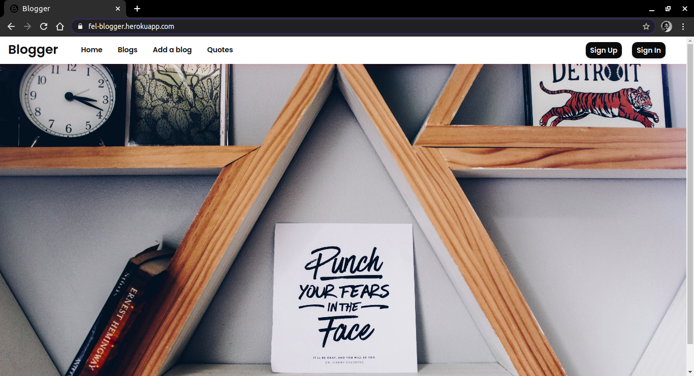
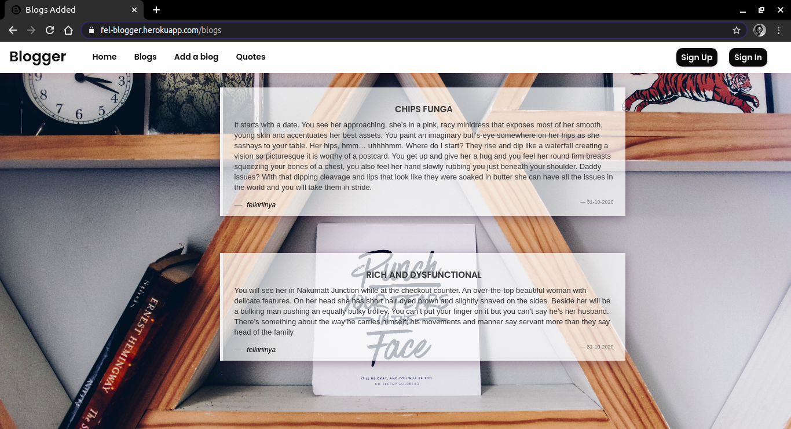

# Blogger

## Description
Blogger is a blog app that allows people from around the world to write posts on anything they want to put out there.

## Live link
Visit the application on https://fel-blogger.herokuapp.com/ .

## Figma Design
This is the link to my [figma](https://www.figma.com/file/vpdhNbdUaeCVObNkpgoh4w/Untitled?node-id=0%3A1) design.
## Development
To make advancements/modifications, follow these steps:

- Fork the repository
- Create a new branch (`git checkout -b improve-feature`)
- Make the appropriate changes in the files
- Add changes made
- Commit your changes (`git commit -am 'Improve feature'`)
- Push to the branch (`git push origin improve-feature`)
- Create a Pull Request 

## Technologies Used
Technologies used to develop this application:

1. Python v3.8
2. Flask 1.1.2
3. Flask-Bootstrap
4. HTML 
5. CSS

## Support and contact details

Should you be unable to access the website, have any recommendations and/or questions, feel free to email me:[felkiriinya@gmail.com](mailto:felkiriinya@gmail.com)

## [License](https://github.com/felkiriinya/Personal-blog/blob/master/LICENSE)

Copyright (c) 2020 [Felista Kiriinya](https://github.com/felkiriinya)
